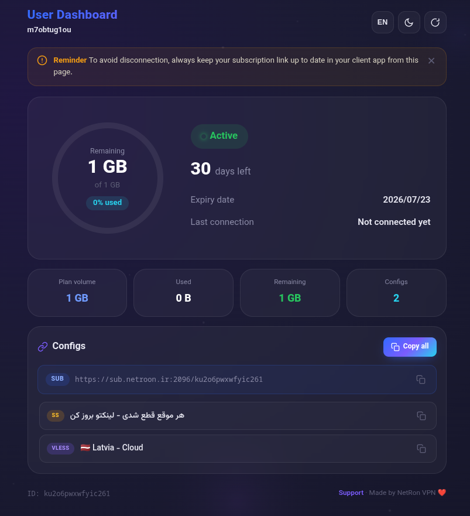

# 🚀 Subscription Page Template for 3x-ui

[🇮🇷 فارسی](README_FA.md)

A modern, responsive, and customizable subscription page template for **3x-ui** panels.

## ✨ Features

* Circular traffic usage indicator
* Service status display
* Expiration date and last connection
* Configuration list with copy button
* Subscription URL with copy button
* Persian / English language support
* Light / Dark theme
* Support ID configuration via `config.json` (no need to edit HTML)

---

## 📁 Project Structure

```text
3x-ui-Subscription-Template/
├── sub.html           (Main template file - must be named sub.html)
├── config.json        (Configuration file)
├── install.sh         (One-line installer)
├── README.md          (English documentation)
└── README_FA.md       (Persian documentation)
```

---
## 📸 Screenshots

### Main Dashboard

Displays subscription information, traffic usage, expiration date, and service status in a modern and responsive layout.


<p align="center">
  
</p>

## 🛠️ Installation

### 1. Run the Installer

Run this single command on your server (as root):

```bash
bash <(curl -Ls https://raw.githubusercontent.com/mahdizo3181/3x-ui-Subscription-Template/main/install.sh)
```

The script downloads the template, asks for your Telegram support ID (optional),
and prints the folder path you need for the panel:

```text
  Installation complete.

  Put this path in your 3x-ui panel:

      /opt/3x-ui-sub-template
```

Run the same command again anytime to update the template — your `config.json` is kept.

To install somewhere else:

```bash
INSTALL_DIR=/root/my-template bash <(curl -Ls https://raw.githubusercontent.com/mahdizo3181/3x-ui-Subscription-Template/main/install.sh)
```

---

### 2. Configure Template Path in 3x-ui

1. Open the 3x-ui panel.
2. Go to **Panel Settings**.
3. Open the **Subscription** tab.
4. Click **Profile**.
5. Paste the path printed by the installer into **Sub Theme Directory**:

```text
/opt/3x-ui-sub-template
```

6. Save changes.
7. Restart the panel once:

```bash
x-ui restart
```

> The template file must be named `sub.html`.

---

### 3. Change Support ID Later (Optional)

Edit `config.json` inside the install folder:

```bash
nano /opt/3x-ui-sub-template/config.json
```

```json
{
  "support_id": "@your_support_username"
}
```

Leave it empty if you do not want to display a support link. No panel restart needed.

---

### 4. Final Test

Create a user with an active subscription and open the subscription URL. The new template should be displayed automatically.

---

## 🔧 Notes

* The template file must be named `sub.html`.
* Use an absolute path, not a relative path.
* Make sure `sub.html` exists in the configured folder.
* Changes in `config.json` do not require a panel restart.
* Manual install still works: clone the repo and use its folder path instead.

---

## 🧑‍💻 Customization

* Edit CSS variables in the `:root` section to change colors.
* Edit the `i18n` object in JavaScript to change texts.

---

## 📄 License

Feel free to modify and use this template in your own projects.

---

**Developer:** Mahdi Zolfaghari

**GitHub:** https://github.com/mahdizo3181/3x-ui-Subscription-Template
