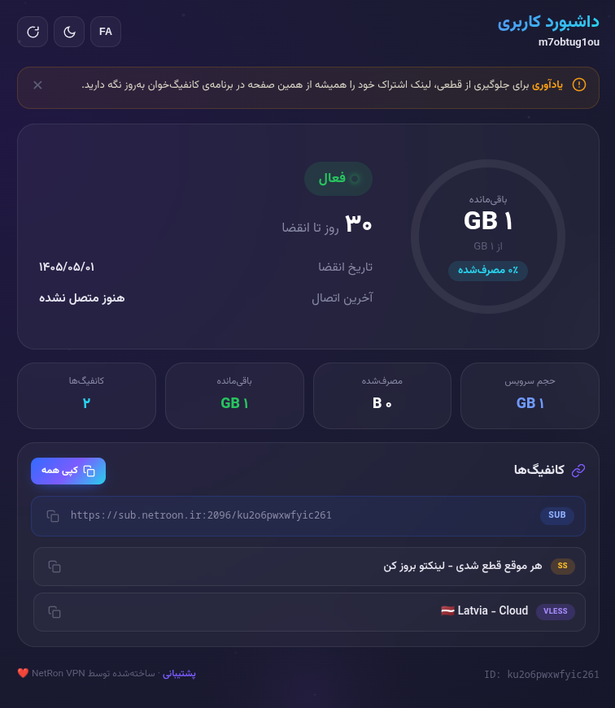

# 🚀 قالب صفحه اشتراک NetRon برای 3x-ui

[🇺🇸 English](README.md)

این قالب، یک صفحه اشتراک مدرن، واکنش‌گرا و زیبا برای پنل **3x-ui** است که اطلاعات کاربر را به‌صورت گرافیکی و کاربرپسند نمایش می‌دهد.

## ✨ ویژگی‌ها

* نمایش دایره‌ای حجم مصرف‌شده و باقی‌مانده
* نمایش وضعیت فعال یا غیرفعال سرویس
* نمایش تاریخ انقضا و آخرین اتصال
* لیست کانفیگ‌ها با قابلیت کپی
* لینک اشتراک با دکمه کپی
* پشتیبانی از زبان فارسی و انگلیسی
* تم روشن و تاریک
* پشتیبانی از فایل `config.json` برای تنظیم آیدی پشتیبانی

---

## 📁 ساختار پروژه

```text
3x-ui-Subscription-Template/
├── sub.html           (فایل اصلی قالب - نام باید sub.html باشد)
├── config.json        (فایل تنظیمات)
├── README.md          (مستندات انگلیسی)
└── README_FA.md       (مستندات فارسی)
```

---
## 📸 تصاویر پروژه

### نمای اصلی

<p align="center">
  
</p>

## 🛠️ نصب و راه‌اندازی

### ۱. کلون کردن مخزن

```bash
cd /root
git clone https://github.com/mahdizo3181/3x-ui-Subscription-Template.git
```

### ۲. دریافت مسیر مطلق

```bash
cd 3x-ui-Subscription-Template
pwd
```

نمونه خروجی:

```text
/root/3x-ui-Subscription-Template
```

این مسیر را کپی کنید.

---

### ۳. تنظیم مسیر قالب در 3x-ui

1. وارد پنل 3x-ui شوید.
2. به بخش **Settings** بروید.
3. تب **Subscription** را باز کنید.
4. روی **Profile** کلیک کنید.
5. مسیر مطلق پوشه قالب را در قسمت **Subscription Page Template** وارد کنید.

نمونه:

```text
/root/3x-ui-Subscription-Template
```

6. تغییرات را ذخیره کنید.
7. یک‌بار پنل را ریستارت کنید.

> فایل قالب باید با نام `sub.html` ذخیره شده باشد.

---

### ۴. تنظیم آیدی پشتیبانی (اختیاری)

فایل `config.json` را ویرایش کنید:

```json
{
  "support_id": "@your_support_username"
}
```

نمونه:

```json
{
  "support_id": "@NetRon_Support"
}
```

در صورت خالی بودن این مقدار، لینک پشتیبانی نمایش داده نخواهد شد.

---

### ۵. تست نهایی

یک کاربر فعال ایجاد کنید و لینک اشتراک او را باز کنید. قالب جدید به‌صورت خودکار نمایش داده خواهد شد.

---

## 🔧 نکات مهم

* نام فایل قالب حتماً باید `sub.html` باشد.
* از مسیر مطلق (Absolute Path) استفاده کنید.
* مطمئن شوید فایل `sub.html` داخل پوشه انتخاب‌شده وجود دارد.
* برای اعمال تغییرات `config.json` نیازی به ریستارت پنل نیست.

---

## 🧑‍💻 شخصی‌سازی

* برای تغییر رنگ‌ها، بخش `:root` در CSS را ویرایش کنید.
* برای تغییر متن‌ها، آبجکت `i18n` در جاوااسکریپت را ویرایش کنید.

---

## 📄 مجوز

استفاده، ویرایش و توسعه این قالب برای پروژه‌های شخصی و عمومی آزاد است.

---

**توسعه‌دهنده:** مهدی ظهرابی

**گیت‌هاب:** https://github.com/mahdizo3181/3x-ui-Subscription-Template
